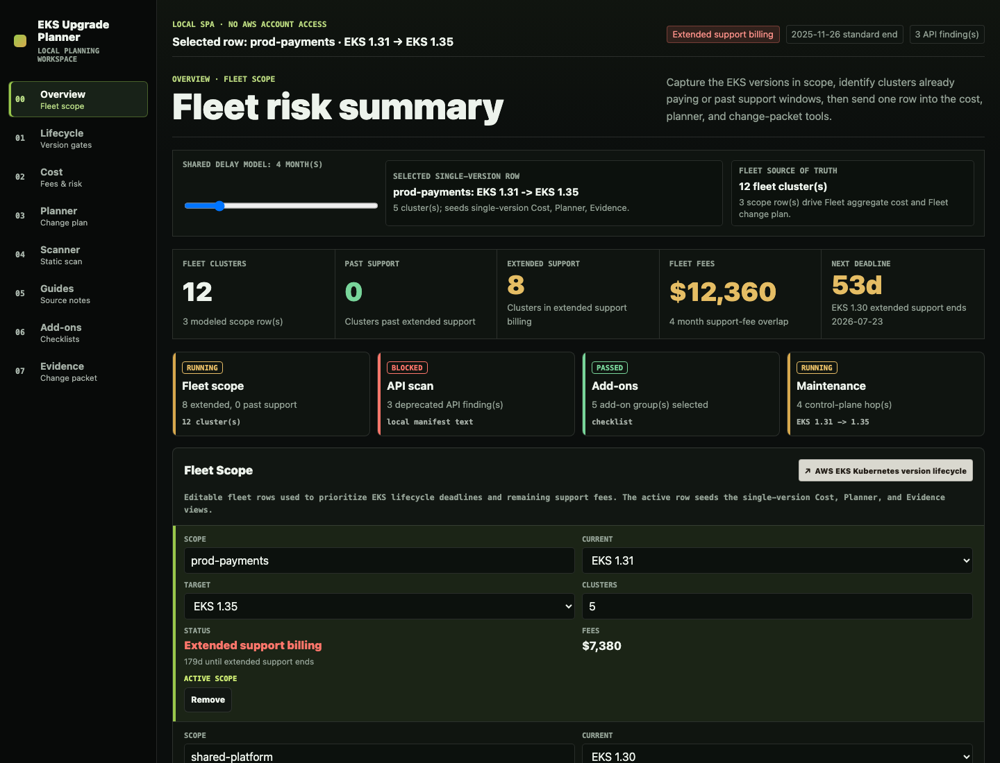

# EKS Upgrade Planner

[](https://github.com/Holdtillstill/eks-upgrade-planner/actions/workflows/ci.yml)
[](https://github.com/Holdtillstill/eks-upgrade-planner/actions/workflows/static-deploy.yml)
[](https://github.com/Holdtillstill/eks-upgrade-planner/actions/workflows/static-smoke.yml)
[](https://github.com/Holdtillstill/eks-upgrade-planner/actions/workflows/eks-data-refresh.yml)
[](https://github.com/Holdtillstill/eks-upgrade-planner/actions/workflows/dependency-audit.yml)
[](https://github.com/Holdtillstill/eks-upgrade-planner/actions/workflows/security.yml)
[](https://github.com/Holdtillstill/eks-upgrade-planner/actions/workflows/secret-scan.yml)

A public, static-heavy web tool for planning Amazon EKS upgrades before they
become extended-support bills or risky change windows.



## Development note

This project was built with AI-assisted coding support. Product direction,
architecture, validation, deployment choices, operations, and maintenance remain
my responsibility.

## Public status

| Surface | Status | Notes |
| --- | --- | --- |
| Static planner | Public static host | `eks-upgrade-planner.bozhi.dev` serves the planner, route-specific static HTML, and browser-local tools. |
| Data freshness | Scheduled check | CI compares checked-in EKS lifecycle data with AWS and endoflife.date sources and opens PRs only when content changes. |
| Container and Helm | Build validated | CI builds and scans the image and renders the Helm chart for preview packaging. |
| EKS runtime preview | Request-only | Shared EKS previews are short-lived validation windows, not always-on infrastructure. |

## What it includes

- EKS lifecycle table with cited static data.
- Extended support cost calculator using EKS control-plane support-tier rates.
- Multi-hop upgrade planner with copyable Markdown/Jira ticket output.
- Managed/platform addon checklist with source links and diagnostic commands.
- Local-only deprecated Kubernetes API scanner for pasted YAML/text.
- A minimal production Node server for the built Vite app with structured logs,
  `/healthz`, `/readyz`, `/metrics`, request IDs, security headers, static asset
  caching, prerendered public route HTML, SPA deep-link fallback, and optional
  OTLP traces/logs.

## Quickstart

```bash
npm install --include=dev
npm run dev -- --host 127.0.0.1
```

Open: http://127.0.0.1:5173/

## Production server

Build the Vite app and serve it with the production server:

```bash
npm run build
PORT=8080 NODE_ENV=production METRICS_BEARER_TOKEN="$(openssl rand -hex 24)" npm start
```

Open: http://127.0.0.1:8080/app

Operational endpoints:

- `GET /healthz` - process liveness.
- `GET /readyz` - verifies `dist/index.html` is readable.
- `GET /metrics` - Prometheus text metrics for process/runtime and HTTP traffic.
- Public deep links such as `/eks/1-35-upgrade-guide` are served from
  prerendered `dist/**/index.html` files, then the React app mounts normally.
- Unknown extensionless routes return a real `404` response. Browser HTML
  requests receive a `noindex` page; API-style requests receive JSON.

`SITE_URL` controls canonical, OpenGraph, `robots.txt`, and `sitemap.xml`
metadata. Production builds require `SITE_URL` to be a public `http` or `https`
origin; `localhost` and `127.0.0.1` are rejected unless
`SITE_URL_ALLOW_LOCALHOST=true` is set for a local/demo build. `npm run build`
defaults to `https://eks-upgrade-planner.bozhi.dev`; set `SITE_URL` explicitly
when building a preview or alternate deployment.
`npm run generate:public-metadata` regenerates `public/robots.txt` and
`public/sitemap.xml`; `npm run build` runs it automatically before Vite and runs
`npm run prerender` afterward. The prerender step writes route-specific static
HTML for `/`, `/app`, the public `/eks/*` pages, every version guide, and every
add-on compatibility route listed in `scripts/public-routes.js`.

Design exploration routes `/1` through `/10` are available in development by
default. Production builds disable them, and development builds can also disable
them with `VITE_ENABLE_DESIGN_EXPLORATIONS=false`.

The server logs JSON to stdout/stderr for container log collection. Set
`OTEL_EXPORTER_OTLP_ENDPOINT=http://collector:4318` to emit OTLP/HTTP traces.
Set `OTEL_LOGS_EXPORTER=otlp` as well to emit application logs through the
OpenTelemetry Collector to Loki. When `NODE_ENV=production`, direct Node or
Docker runs require `METRICS_BEARER_TOKEN` for `/metrics`. Set
`METRICS_ALLOW_UNAUTHENTICATED=true` only for local/demo production runs where
unauthenticated metrics are acceptable.

## Docker

```bash
docker build \
  --build-arg SITE_URL=https://eks-upgrade-planner.bozhi.dev \
  --build-arg APP_VERSION=0.1.0 \
  --build-arg SOURCE_VERSION="$(git rev-parse --short HEAD)" \
  --build-arg BUILD_TIME="$(date -u +%Y-%m-%dT%H:%M:%SZ)" \
  -t eks-upgrade-planner:local .
docker run --rm -p 8080:8080 \
  -e METRICS_BEARER_TOKEN="$(openssl rand -hex 24)" \
  eks-upgrade-planner:local
```

For direct Docker runs in production, pass `-e METRICS_BEARER_TOKEN=...` or set
`-e METRICS_ALLOW_UNAUTHENTICATED=true` for local/demo use.

## Kubernetes and Helm

The chart is in `deploy/helm/eks-upgrade-planner` and does not deploy cloud
resources:

```bash
export IMAGE_REPOSITORY=ghcr.io/acme/eks-upgrade-planner
export IMAGE_TAG=0.1.0
export SITE_URL=https://eks-upgrade-planner.bozhi.dev

helm upgrade --install eks-upgrade-planner deploy/helm/eks-upgrade-planner \
  --namespace eks-upgrade-planner \
  --create-namespace \
  --set image.repository="${IMAGE_REPOSITORY}" \
  --set image.tag="${IMAGE_TAG}" \
  --set env.siteUrl="${SITE_URL}" \
  --set env.sourceVersion="$(git rev-parse --short HEAD)" \
  --set env.buildTime="$(date -u +%Y-%m-%dT%H:%M:%SZ)"
```

It includes Deployment, Service, optional Ingress, ServiceMonitor,
NetworkPolicy, optional HPA, PDB, and a Grafana dashboard ConfigMap.
The production values require bearer-token auth for `/metrics` by default. Use
`metrics.auth.existingSecret` for stable production tokens, or
`-f deploy/helm/eks-upgrade-planner/values.local.yaml` for local/demo installs.

## Observability

Recommended stack for Kubernetes:

- Prometheus and Grafana from `kube-prometheus-stack`.
- Loki for OTLP application logs, or stdout/container logs when paired with a
  node log collector such as Grafana Alloy, Promtail, or Fluent Bit.
- Tempo for request traces.
- OpenTelemetry Collector for OTLP fan-out.

Local/demo values live in `deploy/observability`. See
`docs/observability.md` for install and verification commands.

## Verification

```bash
npm test
npm run build
npm run validate:static-hosting
npm run lint
npm run smoke:local
npm run smoke:browser-host
```

Run `npm run smoke:local` while the production server is already listening on
`http://127.0.0.1:8080`, or set `SMOKE_BASE_URL`. If `/metrics` is token
protected, also export `SMOKE_METRICS_BEARER_TOKEN` or `METRICS_BEARER_TOKEN`.
See `docs/smoke-test-checklist.md` for the pre-launch browser and HTTP smoke
checklist.

## GitHub, CI, and Static Hosting

This repo is structured for a hybrid ownership model:

- App repo: product code, Dockerfile, Helm chart, app CI/CD, static-hosting
  Terraform, Cloudflare mirror workflow, and optional EKS preview workflow.
- Platform infrastructure: Route 53 hosted zone, Terraform backend, GitHub OIDC
  provider/roles, optional shared EKS preview capacity, ingress, preview
  cleanup, and budgets.

GitHub workflows:

- `.github/workflows/ci.yml` runs tests, lint, typecheck, edge-security drift
  checks, production build, static-host validation, Docker build, and image
  scanning on pushes and pull requests.
- `.github/workflows/dependency-audit.yml`, `.github/workflows/security.yml`,
  `.github/workflows/secret-scan.yml`, and `.github/workflows/codeql.yml` run
  npm audit, Dependency Review for public pull requests, Trivy
  filesystem/secret/misconfiguration scans, Gitleaks with an additional
  committed-cloud-identifier guard, and CodeQL source analysis.
- `.github/workflows/static-deploy.yml` deploys `dist/` to S3 and invalidates
  CloudFront using GitHub OIDC. It expects public repository variables
  `AWS_REGION` and `SITE_URL`, plus Actions secrets `AWS_ROLE_TO_ASSUME`,
  `STATIC_SITE_BUCKET`, and `CLOUDFRONT_DISTRIBUTION_ID`. After AWS bootstrap
  resources and GitHub configuration exist, it deploys on relevant pushes to
  `main`. If GitHub environment reviewer protection is enabled later, update the
  AWS OIDC trust policy for that environment-specific subject before adding an
  `environment` binding to this job.
- `.github/workflows/static-smoke.yml` runs scheduled HTTP and Chromium browser
  smoke against the public static host and selected deep links, including
  console, overflow, visitor-telemetry, privacy-signal, and serious/critical
  accessibility checks.
- `.github/workflows/docker-publish.yml` publishes tagged Docker images to
  GHCR.
- `.github/workflows/ecr-publish.yml` is manual-only for private AWS preview
  publishing because ECR registry hostnames are account-scoped.
- `.github/workflows/eks-preview.yml` builds a preview image and can deploy the
  Helm chart into a short-lived shared EKS namespace for demo/review only.
- `.github/workflows/cloudflare-pages.yml` optionally deploys the built static
  output to a Cloudflare Pages mirror.
- `.github/workflows/eks-data-refresh.yml` opens scheduled data refresh PRs
  when AWS/endoflife.date lifecycle data changes.

App-specific AWS static hosting Terraform lives in
`infra/terraform/static-hosting`. It plans a private S3 bucket, CloudFront,
Origin Access Control, ACM certificate, Route 53 records, strict response
headers, clean URL rewrites for prerendered routes, and static `404.html`
mapping. It is intentionally plan-only until DNS, GitHub OIDC, and deployment
role prerequisites exist.

The static build also writes `dist/404.html` and `dist/_headers`. `404.html`
keeps unknown extensionless routes as real noindex 404s when CloudFront maps S3
`403`/`404` misses to it. `_headers` gives Cloudflare Pages the same CSP and
security posture as the Node server.

See `docs/deployment.md` for deployment ownership, preview TTL, and Cloudflare
mirror notes. See `docs/cost-notes.md` for the expected AWS cost posture.
See `docs/roadmap.md` for public product and operations follow-ups.

## Data and trust model

This app uses static source-linked data in `src/data/`. It does **not** call AWS
APIs, store product account data, or upload/store manifests. Scanner results are
computed in the browser. The production server emits operational request logs
that may include request path, status, IP address, and user agent. Verify all
lifecycle/pricing/addon guidance against AWS and upstream project docs before
approving production upgrades.

The public site also loads first-party pageview telemetry from
`on-demand-demos.bozhi.dev` to understand basic route traffic. Pasted manifests,
fleet rows, and planner inputs remain browser-local. Do Not Track and Global
Privacy Control signals are respected by the shared first-party tracker. See
`docs/privacy.md`.

EKS lifecycle freshness is guarded by `scripts/sync-eks-data.js`:

```bash
npm run data:check
npm run data:update
```

`data:check` validates the checked-in EKS lifecycle dataset against the AWS EKS
Kubernetes version lifecycle page, the AWS EKS platform versions page, and the
endoflife.date Amazon EKS archive. `data:update` rewrites
`src/data/versions.ts` and the SEO route mirror in `scripts/public-routes.js`
when those sources drift. The scheduled GitHub workflow in
`.github/workflows/eks-data-refresh.yml` runs the updater, test suite, lint, and
production build, then opens a pull request only when the live source data
changes. The public snapshot date reflects the last verified dataset update
committed to the repo; no-op daily checks stay visible in GitHub Actions rather
than opening date-only pull requests.

## Known limitations

- The scanner is regex/text based, not a full Kubernetes schema validator.
- Addon compatibility is intentionally framed as a verification checklist, not an authoritative compatibility guarantee.
- Cost calculations cover EKS control-plane support-tier pricing only; worker nodes, Fargate, EBS, IPv4, data transfer, and workload costs are excluded.
- Prerendered SEO coverage is generated only for the public route list in
  `scripts/public-routes.js`; add new public landing pages there when they
  should appear in the sitemap and static HTML output.

More production notes are in `docs/production-readiness.md`.

## License

MIT. See `LICENSE`.
